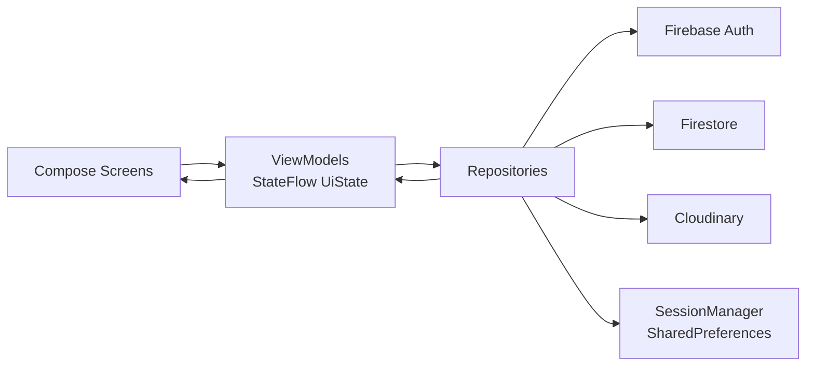
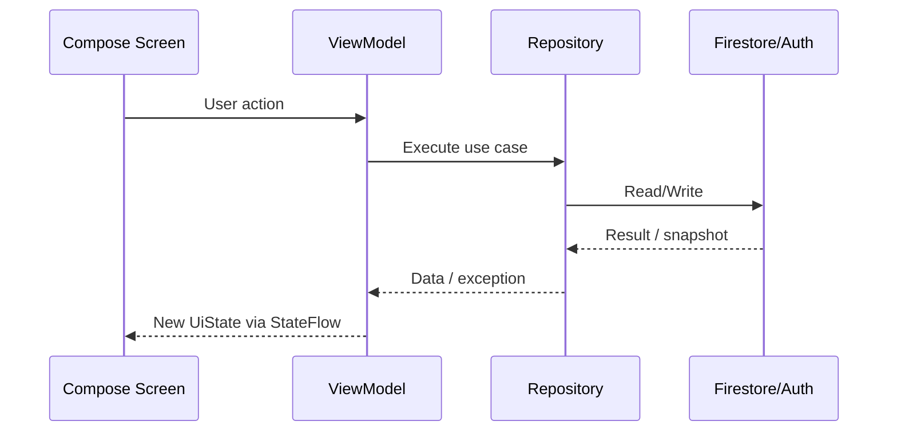
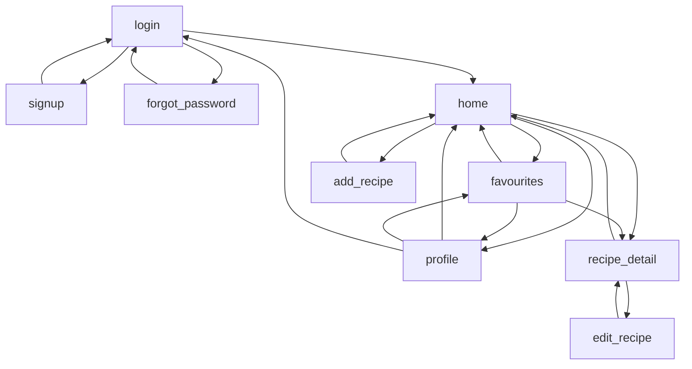

# Homestead Table

## 1. Introduction
Homestead Table is an Android app to create and manage personal recipes in a digital cookbook. The project uses Kotlin, Jetpack Compose, Firebase Authentication, Firebase Firestore, and Cloudinary image uploads.

---

## 2. Context
The app solves a practical problem: many personal/family recipes are still kept on paper. Paper recipes are easy to lose, hard to search, and hard to organize. Homestead Table provides a portable “to-go” recipe app where users can save, edit, and find recipes anytime, without depending on notebooks or printed cards.

---

## 3. Setup / How to Run
### 3.1 Prerequisites
- Android Studio (latest stable)
- Android SDK (min SDK 24, target SDK 36)
- JDK 11
- A Firebase project (Authentication + Firestore)
- A Cloudinary account and unsigned upload preset

### 3.2 Project setup
1. Clone the repository.
2. Open the project in Android Studio.
3. Add `google-services.json` to:
   - `app/google-services.json`
4. Configure Firebase:
   - Enable Email/Password authentication.
   - Create a Firestore database.
5. Configure Cloudinary:
   - Use the already defined cloud name (or update `MainActivity.kt` if changed).
   - Ensure unsigned preset `HomesteadTable` exists (or update `ImageRepository.kt`).

### 3.4 Run
1. Sync Gradle.
2. Build and run from Android Studio on an emulator or physical device.

### 3.5 Notes
- The Gradle wrapper currently references plugin/dependency versions that may not resolve in all environments (for example AGP/Compose versions in `gradle/libs.versions.toml`).
- If dependency resolution fails, align AGP/Kotlin/Compose versions with currently available stable versions.

---

## 4. Project Architecture
The project follows a layered MVVM structure:
- **UI layer (Compose screens):** renders state and sends user actions.
- **ViewModel layer:** owns screen state as `StateFlow`, validates inputs, coordinates async work.
- **Data layer (repositories):** handles Firebase Auth, Firestore, image upload, and session preferences.
- **Backend services:** Firebase Auth, Firestore, Cloudinary.



---

## 5. State Management - MVVM with StateFlow
State management is centered on immutable UI state data classes and `MutableStateFlow` in each ViewModel:
- Each screen exposes `StateFlow<UiState>`.
- Compose observes state via `collectAsState()`.
- UI events call ViewModel intents (`onLoginClick`, `onSaveRecipe`, `onCategorySelect`, etc.).
- ViewModels update state with `.update { it.copy(...) }`.
- Repositories provide shared data streams (notably `RecipeRepository.recipes`) consumed by multiple ViewModels.



---

## 6. Database (Firestore)
Firestore is used as the primary cloud database.

### 6.1 Collection
- `recipes`

### 6.2 Recipe document model
- `id` (UUID)
- `userId`
- `title`
- `category`
- `baseServings`
- `imageUrl`
- `ingredients` (name, quantity, unit)
- `equipment` (list of strings)
- `instructions` (list of strings)
- `isFavourite`

### 6.3 Data behavior
- Recipes are scoped per user (`whereEqualTo("userId", uid)`).
- Real-time updates use Firestore snapshot listeners.
- CRUD is supported (add, update, delete).
- Favorite state is persisted in Firestore.

---

## 7. Implemented Functionalities
- Email/password authentication (sign up, login, logout).
- Remember-me session behavior with SharedPreferences.
- Password reset via email.
- Recipe CRUD:
  - Create recipe with photo, category, servings, ingredients, equipment, instructions.
  - Edit existing recipe.
  - Delete recipe with confirmation.
- Recipe detail screen with dynamic servings scaler.
- Favorite/unfavorite recipes.
- Search and category filtering in cookbook and favorites.
- Real-time recipe synchronization from Firestore.
- Bilingual strings support (English + Portuguese resources).

---

## 8. UI Components
Key Compose components used across the app:
- `Scaffold`, `TopAppBar`, `NavigationBar`, `NavigationBarItem`
- `LazyColumn`, `LazyRow`
- `Card`, `Surface`, `AlertDialog`
- `OutlinedTextField`, `ExposedDropdownMenuBox`, `DropdownMenuItem`
- `Button`, `OutlinedButton`, `TextButton`, `IconButton`, `FilledIconButton`
- `AsyncImage` (Coil) for remote and local image previews
- `CircularProgressIndicator` for loading states

---

## 9. App Navigation
Navigation uses `androidx.navigation.compose` through a single `NavHost` in `AppNavigation.kt`.

### 9.1 Routes
- `login`
- `signup`
- `forgot_password`
- `home`
- `favourites`
- `profile`
- `add_recipe`
- `recipe_detail/{recipeId}`
- `edit_recipe/{recipeId}`

### 9.2 Navigation diagram


---

## 10. Design e User Experience (UX)
The UX is focused on simplicity and quick access:
- **Clear information hierarchy:** large headers, sectioned forms, card-based recipe lists.
- **Fast actions:** one-tap favorite toggle, add button from home, direct edit/delete in detail view.
- **Guided forms:** structured recipe creation/editing with validations and dynamic list fields.
- **Feedback:** progress indicators, inline errors, and success states (e.g., reset email sent).
- **Consistency:** reusable visual language (terracotta palette, rounded shapes, Material 3 patterns).
- **Accessibility considerations:** readable typography scale and high-contrast accents in both light/dark themes.

---

## 11. Development Process
The implementation reflects an incremental feature-first process:
1. Core app setup (Compose + theme + navigation shell).
2. Authentication flow (login/sign up/forgot password).
3. Data layer integration (Firestore repositories and auth/session abstraction).
4. Recipe management features (add/edit/detail/delete/favorites).
5. Filtering/search and profile flow.
6. UX refinements (empty states, loading states, multilingual strings, visual polish).

---

## 12. File Structure
```text
app/src/main/java/dam_a51564/homesteadtable/
├── MainActivity.kt
├── data/
│   ├── AuthRepository.kt
│   ├── ImageRepository.kt
│   ├── RecipeRepository.kt
│   └── SessionManager.kt
├── model/
│   ├── Recipe.kt
│   ├── RecipeCategories.kt
│   └── RecipeUnits.kt
├── navigation/
│   └── AppNavigation.kt
├── ui/
│   ├── screens/
│   │   ├── login/
│   │   ├── signup/
│   │   ├── forgot_password/
│   │   ├── home/
│   │   ├── favourites/
│   │   ├── profile/
│   │   ├── detail/
│   │   └── recipe_management/
│   └── theme/
│       ├── Color.kt
│       ├── Theme.kt
│       └── Type.kt
└── res/
    ├── values/
    └── values-pt-rPT/
```

---

## 13. Current State of Development
Current implementation status:
- Main end-user flow is implemented (auth + recipe lifecycle + favorites + profile).
- Architecture is consistent with MVVM + StateFlow.
- Firestore real-time syncing and Cloudinary uploads are integrated.
- UI is complete for primary use cases.

---

## 14. Next Steps
1. Improve profile area (avatar management, editable profile fields).
2. Add Firestore security rules documentation and production hardening checklist.
3. Add share-intent support so when users tap Share in other apps, Homestead Table is recommended and can save the shared recipe link.
4. Add a social component to the project so users can share their recipes with their friends.
5. Add offline-first caching strategy for recipes.
6. Add sorting options and richer filtering (time, ingredients, difficulty).
7. Add image compression/optimization and upload failure retry policy.

---

## 15. License

Personal/academic project. No open-source license defined.
